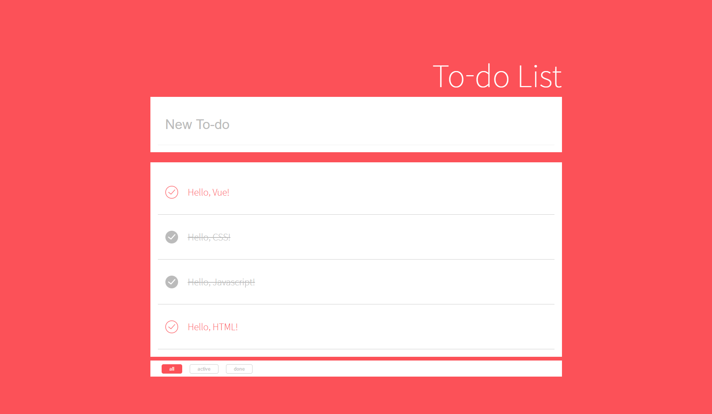

# To-do List

- [Javascript](https://github.com/may54ther/to-do-list/blob/master/README.md#javascript)
- [Vue.js](https://github.com/may54ther/to-do-list/blob/master/README.md#vuejs)

## Javascript

노마드코더의 자바스크립트 강의를 보고 만든 클론 코딩

- 시간 제공
- 사용자 이름 입력(localStorage)
- To-Do 리스트(localStorage, 삭제)
- 배경 전환 효과

 

## Vue.js

레시피 사이트의 뷰 투두리스트 강의를 보고 만든 클론 코딩

- Vue-Cli
- To-Do 리스트(저장기능 없음, 삭제)
- All, Active, Done의 형태로 To-Do 리스트 볼 수 있음

  - All : 완료되지 않은 항목, 완료된 항목의 모든 To-Do 리스트를 볼 수 있다.
  - Active : 완료되지 않은 To-Do 리스트를 볼 수 있다.
  - Done : 완료 된 To-Do 리스트를 볼 수 있다.
     ※ 버튼의 기능은 작동하지만 눌렀을 때 버튼이 활성화 되도록 변경해야 함(\*)

  
