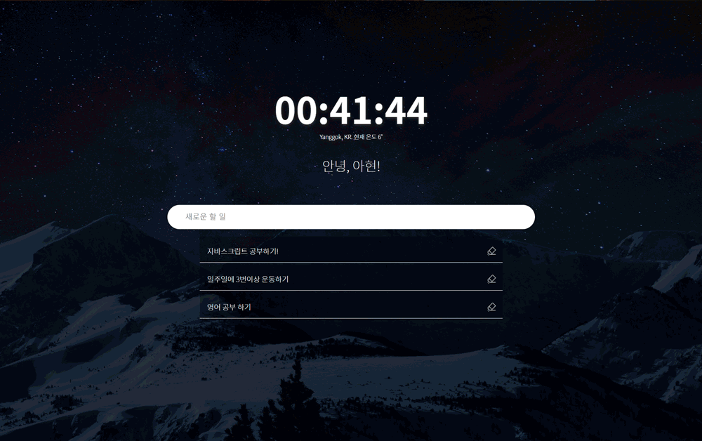

# To-do List

Javascript와 Vue를 사용해서 만든 To-Do List입니다.
  클론 강의 보고 틀을 제작 후 디자인/추가 사항을 수정하여 정리하였습니다.

- [Javascript](https://github.com/may54ther/todoList/blob/master/README.md#javascript)
- [Vue.js](https://github.com/may54ther/todoList/blob/master/README.md#vuejs)

  

## Javascript

노마드코더의 자바스크립트 강의를 보고 만든 클론 코딩
[[바로가기]](https://may54ther.github.io/todoList/javascript/index.html)

- 시간 제공
- 사용자 이름 입력(localStorage)
- To-Do 리스트(localStorage, 삭제)
- 배경 전환 효과
- .trim()을 이용해 공백/내용 없이 엔터만 입력시에도 입력이 되었던 사항을 수정함

 

   

## Vue.js

레시피 사이트의 뷰 투두리스트 강의를 보고 만든 클론 코딩
[[바로가기]](https://may54ther.github.io/todoList/vue/dist/index.html)

- To-Do 리스트(localStorage 저장 X, 삭제)
- All, Active, Done의 형태로 To-Do 리스트 볼 수 있음

  - All : 완료되지 않은 항목, 완료된 항목의 모든 To-Do 리스트를 볼 수 있다.
  - Active : 완료되지 않은 To-Do 리스트를 볼 수 있다.
  - Done : 완료 된 To-Do 리스트를 볼 수 있다.

- ~~버튼의 기능은 작동하지만 눌렀을 때 버튼이 활성화 되도록 변경해야 함(\*)~~ [완료]
  - array.filter()로 수정!
- .trim()을 이용해 공백/내용 없이 엔터만 입력시에도 입력이 되었던 사항을 수정함

 

